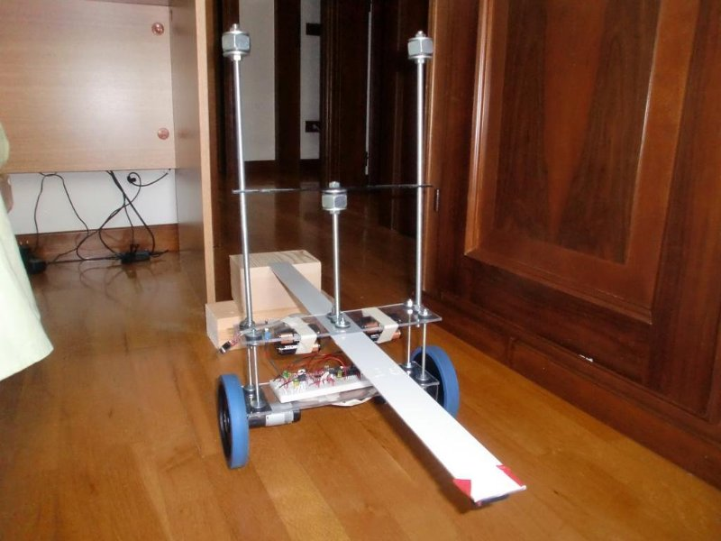
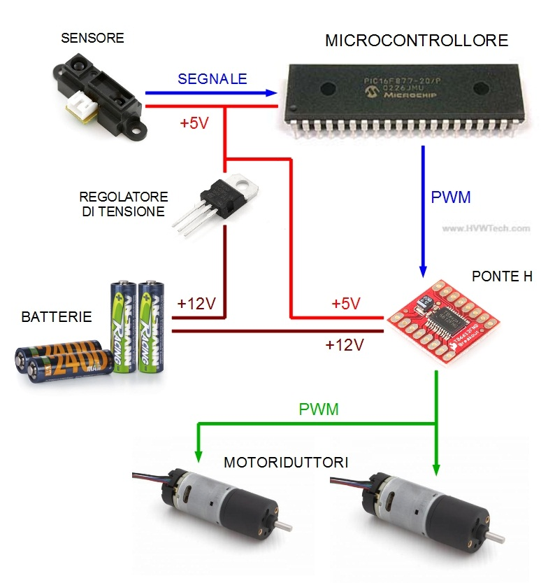
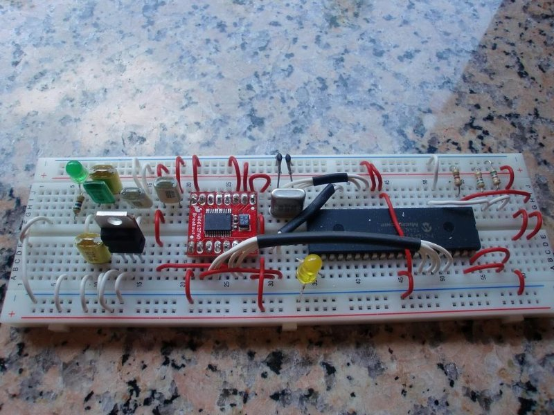

## Self Balancing Robot

### [Youtube video](https://www.youtube.com/watch?v=_Ge0RNVOyVg)

#### Introduction

Back in 2011, Segways were very popular, so I decided to build my little model of it for the high-school exam.
It is essentially a really simple robot, that once is turned on can understand its position (distance sensor from the ground), process data, and calculate the necessary amount of power needed for the engines to balance the entire structure.

#### Block Diagram

#### Components

*   Pack of AA batteries
*   Voltage Regulator - LM7805
*   Analog Distance Sensor - Sharp GP2D12
*   Microcontroller - PIC16F876
*   H_Bridge
*   2 brushless engines

#### Compiler

I used a trial version of Mikrobasic, that allowed me to write 'Basic' and compile it for PIC
https://www.mikroe.com/mikrobasic-pic

#### Software

I've written a small 'main.bas' file (you can find it here in the repo)
Comments are in italian, but, long story short, it's purpose is to collect the data we read from the Distance Sensor and convert to PWM signal to be sent to the H_Bridge

#### Circuit

I used a bread board to build up the circuit

